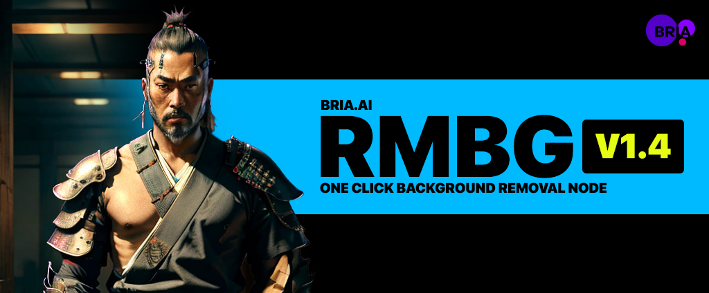

# RMBG Background Removal Node - Community Node for InvokeAI

This is an implementation of a background removal models trained using the [Highly Accurate Dichotomous Image Segmentation research](https://github.com/xuebinqin/DIS) for use with InvokeAI 4.0 and above.

Supported Models:

- [BriaAI](https://huggingface.co/briaai/RMBG-1.4) - A SOTA background removal model from BriaAI.
- [Open RMBG](https://huggingface.co/schirrmacher/ormbg) - A fully open-source model optimized for images with humans. This model is similar to BriaAI 1.4, but with open training data/process and commercially free to use.

_Note: If you are looking to use this with an older version of Invoke, please use the [3.x branch](https://github.com/blessedcoolant/invoke_bria_rmbg/tree/3.x) instead._



# Installation

Go to your `nodes` folder in your `root` directory and clone this repo

```
git clone https://github.com/blessedcoolant/invoke_bria_rmbg.git
```

#### Models

The required models will be automatically downloaded to your `root` directory.

If you need to manually download the models, you can get them here from Microsoft and place them in your `INVOKE_ROOT/models/any/bria-rmbg`. Do not rename the files.

- `model.pth` - [Download](https://huggingface.co/briaai/RMBG-1.4/resolve/main/model.pth?download=true)
- `ormbg.pth` - [Download](https://huggingface.co/schirrmacher/ormbg/resolve/main/models/ormbg.pth?download=true)

# Usage

Add the BRIA AI Background Removal node. Plug in an image. That's it.

### Contribution

Feel free to fix anything or improve it anyway and make a PR. Thank you!

### Credits

- [BriaAI](https://huggingface.co/briaai/RMBG-1.4)
- [Open RMBG](https://huggingface.co/schirrmacher/ormbg)
